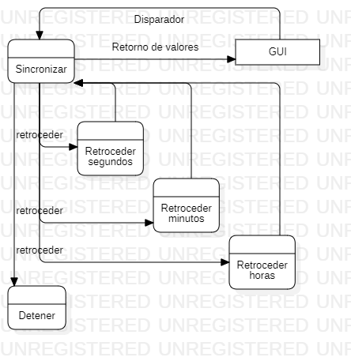

# Chronotimer2
## Jorge Galeano && Juan Sebastian Moreno
## Diagrama de casos de uso

## Diagramas de actividades
### Cronómetro
#### Iniciar

#### Pausar 

#### Guardar memoria 

#### Detener 

#### Reiniciar 

### Temporizador
#### Establecer tiempo inicial

#### Inciar 

#### Pausar 

#### Reiniciar 

## Especificación de requerimientos
### Cronómetro

| Requerimiento:                          | Iniciar cronómetro                                                |
| --------------------------------------- | ----------------------------------------------------------------- |
| Actores:                                | Usuario                                                           |
| Precondiciones:                         | El cronómetro esta pausado                                        |
| Escenarios:                             |                                                                   |
| 1                                       | El cronómetro cambia estado a avanzar                             |
|                                         | El cronómetro inicia avanzar cronómetro
| 2                                       | Si el cronómetro no esta en estado de pausa, iniciar no es válido |
| Poscondiciones:                         | El cronómetro esta en estado avanzar                              |

| Requerimiento:  | Avanzar cronómetro                                                                                  |
|-----------------|-----------------------------------------------------------------------------------------------------|
| Actores:        | NA                                                                                                  |
| Precondiciones: | El cronómetro esta en estado de avanzar                                                             |
| Escenarios:     |                                                                                                     |
| 1               | El cronómetro indica a la unidad de tiempo mas pequeña que avance                                   |
|                 | Las unidades de tiempo retornan el valor al cronómetro                                              |
|                 | Si el valor retornado es un cero el cronómetro le indica a la siguiente unidad de tiempo que avance |
|                 | Este flujo se repite para las diferentes unidades de tiempo del cronómetro                          |
| 2               | Si el cronómetro no esta en estado de avanzar, avanzar no es válido                                 |
| Poscondiciones: | El cronómetro retorna el valor del tiempo en todas sus unidades a la interfaz de usuario            |

| Requerimiento:  | Avanzar unidad de tiempo                                                           |
|-----------------|------------------------------------------------------------------------------------|
| Actores:        | NA                                                                                 |
| Precondiciones: | El cronómetro esta en estado de avanzar                                            |
| Escenarios:     |                                                                                    |
| 1               | El cronómetro indica a la unidad de tiempo que avance                              |
|                 | La unidad de tiempo incrementa su valor                                            |
|                 | Si el valor iguala el tope el valor vuelve a cero                                  |
|                 | La unidad de tiempo retorna su valor                                               |
| 2               | Si el cronómetro no esta en estado de avanzar la unidad de tiempo no puede avanzar |
| Poscondiciones: | El cronómetro ha avanzado una unidad de tiempo                                     |

| Requerimiento:  | Controlar topes máximos                                                            |
|-----------------|------------------------------------------------------------------------------------|
| Actores:        | NA                                                                                 |
| Precondiciones: |                                                                                    |
| Escenarios:     |                                                                                    |
| 1               | El cronómetro indica a la unidad de tiempo que avance                              |
|                 | La unidad de tiempo incrementa su valor                                            |
|                 | Si el valor iguala el tope el valor vuelve a cero                                  |
|                 | La unidad de tiempo retorna su valor                                               |
| 2               | Si el cronómetro no esta en estado de avanzar la unidad de tiempo no puede avanzar |
| Poscondiciones: | El cronómetro esta en estado de avanzar                                            |

| Requerimiento:  | Pausar cronómetro                                                                  |
|-----------------|------------------------------------------------------------------------------------|
| Actores:        | Usuario                                                                            |
| Precondiciones: | El cronómetro esta en estado de avanzar                                            |
| Escenarios:     |                                                                                    |
| 1               | El cronómetro indica a la unidad de tiempo que avance                              |
|                 | La unidad de tiempo incrementa su valor                                            |
|                 | Si el valor iguala el tope el valor vuelve a cero                                  |
|                 | La unidad de tiempo retorna su valor                                               |
| 2               | Si el cronómetro no esta en estado de avanzar la unidad de tiempo no puede avanzar |
| Poscondiciones: | El cronómetro esta en estado detener                                               |

| Requerimiento:  | Pausar cronómetro                                       |
|-----------------|---------------------------------------------------------|
| Actores:        | Usuario                                                 |
| Precondiciones: | El cronómetro esta en estado de avanzar                 |
| Escenarios:     |                                                         |
| 1               | El cronómetro cambia su estado a detener                |
| 2               | Si el cronómetro no esta en avanzar pausar no es válido |
| Poscondiciones: | El cronómetro esta en estado detener                    |

| Requerimiento:  | Guardar memoria                                                                            |
|-----------------|--------------------------------------------------------------------------------------------|
| Actores:        | Usuario                                                                                    |
| Precondiciones: | El cronómetro esta en estado de avanzar y existe al menos un espacio de memoria disponible |
| Escenarios:     | El cronometro captura el valor de las unidades de tiempo                                   |
| 1               | Los valores son enviados a un espacio en memoria                                           |
|                 | La interface de usuario muestra el valor en la memoria                                     |
| 2               | Si el cronómetro esta detenido, almacenar en memoria no es válido                          |
| 3               | Si no existe una memoria vacía almacenar en memoria no es válido                           |
| Poscondiciones: | Se ocupa un espacio en la memoria con el valor de las unidades de tiempo                   |

| Requerimiento:  | Detener cronómetro                                       |
|-----------------|----------------------------------------------------------|
| Actores:        | Usuario                                                  |
| Precondiciones: | El cronómetro esta en estado de avanzar                  |
| Escenarios:     |                                                          |
| 1               | El cronómetro cambia su estado a detener                 |
| 2               | Si el cronómetro no esta en avanzar detener no es válido |
| Poscondiciones: | El cronómetro esta en estado detener                     |

| Requerimiento:  | Reiniciar cronómetro                                                                         |
|-----------------|----------------------------------------------------------------------------------------------|
| Actores:        | Usuario                                                                                      |
| Precondiciones: |                                                                                              |
| Escenarios:     |                                                                                              |
| 1               | Si el cronómetro esta en avanzar cambia su estado a detener                                  |
|                 | El cronómetro le pide a todas las unidades de tiempo que vuelvan a 0                         |
|                 | El cronómetro elimina todos los datos de la memoria                                          |
| Poscondiciones: | El cronómetro se detiene vuelve a su estado inicial con tiempo 0 y todas las memorias vacias |

### Temporizador
| Requerimiento:  | Iniciar temporizador                                                |
|-----------------|---------------------------------------------------------------------|
| Actores:        | Usuario                                                             |
| Precondiciones: | El temporizador esta pausado                                        |
| Escenarios:     |                                                                     |
| 1               | El temporizador cambia estado a retroceder                          |
|                 | El temporizador inicia avanzar temporizador                         |
| 2               | Si el temporizador no esta en estado de pausa, iniciar no es válido |
| Poscondiciones: | El temporizador esta en estado retroceder                           |

| Requerimiento:  | Retroceder temporizador                                                                             |
|-----------------|-----------------------------------------------------------------------------------------------------|
| Actores:        | NA                                                                                                  |
| Precondiciones: | El temporizador esta en estado de retroceder                                                        |
| Escenarios:     |                                                                                                     |
| 1               | El temporizador indica a la unidad de tiempo mas pequeña que retroceda                              |
|                 | Las unidades de tiempo retornan el valor al temporizador                                            |
|                 | Si el valor retornado es 59 el temporizador le indica a la siguiente unidad de tiempo que retroceda |
|                 | Este flujo se repite para las diferentes unidades de tiempo del temporizador                        |
| 2               | Si el temporizador no esta en estado de retroceder, retroceder no es válido                         |
| Poscondiciones: | El temporizador retorna el valor del tiempo en todas sus unidades a la interfaz de usuario          |

| Requerimiento:  | Retroceder unidad de tiempo                                                                |
|-----------------|--------------------------------------------------------------------------------------------|
| Actores:        | NA                                                                                         |
| Precondiciones: | El temporizador esta en estado de retroceder                                               |
| Escenarios:     |                                                                                            |
| 1               | El temporizador indica a la unidad de tiempo que retroceda                                 |
|                 | La unidad de tiempo decrementa su valor                                                    |
|                 | Si el valor iguala el tope el valor vuelve a 59                                            |
|                 | La unidad de tiempo retorna su valor                                                       |
| 2               | Si el temporizador no esta en estado de retroceder la unidad de tiempo no puede retroceder |
| Poscondiciones: | El temporizador ha retrocedido una unidad de tiempo                                        |

| Requerimiento:  | Controlar topes mínimos                                                                   |
|-----------------|-------------------------------------------------------------------------------------------|
| Actores:        | NA                                                                                        |
| Precondiciones: |                                                                                           |
| Escenarios:     |                                                                                           |
| 1               | El temporizador indica a la unidad de tiempo que retroceda                                |
|                 | La unidad de tiempo decrementa su valor                                                   |
|                 | Si el valor iguala el tope el valor vuelve a 59                                           |
|                 | La unidad de tiempo retorna su valor                                                      |
| 2               | Si el temporizador no esta en estado de rtroceder la unidad de tiempo no puede retroceder |
| Poscondiciones: | El temporizador esta en estado de retroceder                                              |

| Requerimiento:  | Pausar temporizador                                          |
|-----------------|--------------------------------------------------------------|
| Actores:        | Usuario                                                      |
| Precondiciones: | El temporizador esta en estado de retroceder                 |
| Escenarios:     |                                                              |
| 1               | El temporizador cambia su estado a detener                   |
| 2               | Si el temporizador no esta en retroceder pausar no es válido |
| Poscondiciones: | El temporizador esta en estado detener                       |

| Requerimiento:  | Establecer tiempo inicial                                          |
|-----------------|--------------------------------------------------------------------|
| Actores:        | Usuario                                                            |
| Precondiciones: | El temporizador esta detenido                                      |
| Escenarios:     |                                                                    |
| 1               | El temporizador pide al usuario los valores de tiempo inicial      |
|                 | Los valores son asignados a las diferentes unidades de tiempo      |
| 2               | Si el temporizador no esta detenido establecer tiempo no es válido |
| Poscondiciones: | El temporizador tiene un tiempo inicial asignado                   |

| Requerimiento:  | Reiniciar temporizador                                                                    |
|-----------------|-----------------------------------------------------------------------------------------|
| Actores:        | Usuario                                                                                 |
| Precondiciones: |                                                                                         |
| Escenarios:     |                                                                                         |
| 1               | Si el temporizador esta en retroceder cambia su estado a detener                        |
|                 | El temporizador le pide a todas las unidades de tiempo que vuelvan al valor establecido |
| Poscondiciones: | El temporizador se detiene y vuelve a su estado el tiempo inicial establecido           |

## Diagramas de secuencia
### Cronómetro
#### Iniciar

#### Pausar 

#### Guardar en memoria 

#### Detener 

#### Reiniciar 

### Temporizador
#### Establecer tiempo inicial 

#### Iniciar 

#### Pausar 

#### Reiniciar 

## Diagramas de flujo de datos
### Avanzar cronómetro

### Retroceder temporizador

## Diagrama de clases

